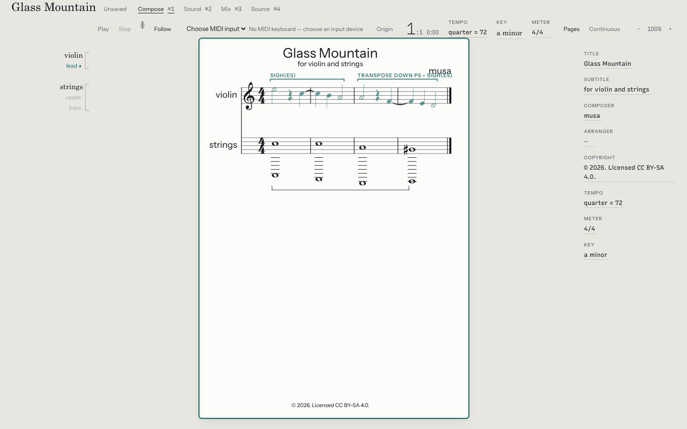

# musa

A notation-first music language and workbench. Write a piece as text, reuse and transform its material, then engrave the
score, hear it, or export it to other music software.

The `.musa` file is the master document. Editing in the desktop app changes that text. Generated notes retain their
origin, so you can trace a transposed phrase back to the motif and the call that produced it.



*Origin view in the desktop editor, using the tested [Glass Mountain](examples/glass-mountain.musa) fixture.*

Musa is experimental and built from source. The current workbench has been validated on macOS; builds and behavior on
other platforms need independent verification. The source language and APIs may change.

## A first piece

This is [examples/twinkle.musa](examples/twinkle.musa), which the test suite compiles:

```musa
piece "twinkle" {
    composer "traditional";
    arranger "musa";

    tempo 1/4 = 104;
    meter 4/4;
    key c major;

    score {
        part piano {
            voice melody {
                | c4/4 c4/4 g4/4 g4/4
                | a4/4 a4/4 g4/2
                | f4/4 f4/4 e4/4 e4/4
                | d4/4 d4/4 c4/2
                | rest/1
            }
        }
    }
}
```

`c4/4` is middle C for a quarter note; `g4/2` is G for a half note. Durations are exact fractions of a whole note. Each
`|` begins a measure whose duration the compiler checks against the meter.

## Try it

Install a current stable [Rust toolchain](https://rustup.rs). Native audio dependencies are also required: on Linux,
install your distribution's ALSA development package and `pkg-config`.

```bash
git clone https://github.com/jcreinhold/musa.git
cd musa
cargo run -p musa -- check examples/twinkle.musa
cargo run -p musa -- render examples/twinkle.musa --to musicxml -o twinkle.musicxml
cargo run -p musa -- render examples/twinkle.musa --to wav -o twinkle.wav
```

Open the MusicXML in your notation software or listen to the WAV. MEI, LilyPond, and MIDI are also supported. Without an
instrument declaration, playback uses the default instrument.

For the desktop editor, install [Node.js](https://nodejs.org) 22.13 or later, [pnpm](https://pnpm.io/installation/)
11.20.0 (the version pinned in `package.json`), and the
[Tauri system prerequisites](https://v2.tauri.app/start/prerequisites/) for your platform. On macOS, the desktop build
needs Xcode Command Line Tools; the Audio Unit build needs full Xcode.

```bash
npm install --global pnpm@11.20.0
make setup
make desktop
```

`make setup` installs the JavaScript dependencies and the Chromium browser used by screen tests. `make desktop` opens
the editor; open a file from `examples/` to start. `make ui` runs a browser preview against test fixtures. The preview
does not compile your edits or play audio; use the desktop app or CLI for that.

Start learning with [Getting started](docs/book/src/tutorials/getting-started.md), then
[First pieces](docs/book/src/guide/first-pieces.md). The [language reference](docs/book/src/reference/language.md) and
[CLI reference](docs/book/src/reference/cli.md) cover the full surface. The book can also be built locally with
[mdBook](https://rust-lang.github.io/mdBook/): `make docs-serve`.

## What you can do

- **Compose with reusable material.** Motifs, functions, repeats, transposition, inversion, and exact-time operations
  produce notes whose source remains traceable. See [Glass Mountain](examples/glass-mountain.musa) and
  [canon-functions.musa](examples/canon-functions.musa).
- **Keep notation and performance distinct.** Tuplets, changing or absent meter, swing, rubato, articulations, and
  performance profiles preserve what is written while specifying how it sounds. See
  [performed and written time](docs/book/src/concepts/performed-and-written-time.md).
- **Describe the sound in source.** Instruments, oscillators, envelopes, filters, effects, modulation, buses, and sends
  feed the same live and offline audio engine. Verified sample banks and recorded media are supported through explicit
  asset contracts. See [sound making](docs/book/src/guide/sound-making.md).
- **Edit and inspect the score.** The desktop workbench provides engraving, source editing, Origin view, analysis, group
  transformations, and MIDI phrase capture with Review and Accept.
- **Use other music software.** Export MEI, LilyPond, MusicXML, MIDI, or WAV. macOS also has live MIDI, transport sync,
  and Audio Units for Logic Pro and GarageBand. Conversions report their
  [limits and losses](docs/book/src/reference/losses.md); see the
  [workstation tutorial](docs/book/src/tutorials/into-a-workstation.md).
- **Use an editor or a web page.** Build `musa-lsp` for diagnostics, hover, completion, formatting, and navigation over
  stdio; [editor setup](docs/book/src/how-to/editor-setup.md) explains it. [@musa/web](packages/musa-web/README.md)
  compiles and engraves snippets in web pages. Browser snippet playback is deferred.

An instrument from Glass Mountain, declared inside its piece:

```musa
instrument glass_pad conforms note_instrument {
    implementation graph {
        carrier = oscillator(sine);
        shimmer = oscillator(sine, ratio: 2) |> gain(-15 dB);

        mix(carrier, shimmer)
            |> envelope(adsr(attack: 30 ms, decay: 1.8 s, sustain: 0.65, release: 3.5 s))
            |> lowpass(cutoff: 1400 Hz, resonance: 0.7)
            |> output;
    }
}
```

The piece assigns parts to this instrument and routes their outputs in a `studio` block.
[Write for the studio](docs/book/src/how-to/studio.md) explains the wiring.

## For contributors

Musa is a Rust workspace with a Tauri/Svelte desktop shell and a pnpm workspace for the UI and web packages. The
compiler elaborates source through a dependently typed calculus into finite event tracks. Notation and performance are
separate readings of those tracks; the project session exposes their results to the CLI, LSP, desktop, and Audio Units.

| Layer | Crates |
| --- | --- |
| Syntax and checked language | `musa-syntax`, `musa-calculus` |
| Exact time and musical values | `musa-events`, `musa-score` |
| Compilation and export | `musa-compiler`, `musa-notation` |
| Sound and live playback | `musa-dsp`, `musa-playback` |
| Session and native shells | `musa-project`, `musa`, `musa-lsp`, `musa-au`, `apps/musa-desktop` |
| Web compilation and engraving | `musa-wasm`, `packages/musa-engrave`, `packages/musa-web` |

Written pitch, MIDI note number, written duration, performed duration, voice, and mixer routing remain distinct. Musical
time is rational; the audio boundary selects sample frames. The audio callback must not allocate, lock, or do I/O.
[Architecture](docs/book/src/concepts/architecture.md) explains these boundaries and the limits of the correctness
claims; [the code map](docs/plan/code-map/README.md) locates their implementations.

`make` lists repository tasks. `make verify` runs the native/workbench gates: formatting, Clippy, UI lint, Rust tests,
UI types and tests, documentation checks, and dependency auditing. Some tools are optional in that target; check its
output for skipped gates. Building the book requires `mdbook`.

The web packages and the tree-sitter grammar have additional checks:

```bash
bash scripts/build-wasm.sh
pnpm -r check
pnpm -r --workspace-concurrency=1 test
pnpm --filter @musa/web test:package
npm --prefix editors/tree-sitter-musa ci
npm --prefix editors/tree-sitter-musa test
```

The [web build script](scripts/build-wasm.sh) documents its Rust target and matching `wasm-bindgen` requirements. The
grammar has its own npm lockfile. Slow Rust checks are available with `cargo nextest run --workspace --run-ignored all`;
host and cable requirements are stated on the relevant tests.

Read [docs/README.md](docs/README.md) before changing semantics. It maps the governing rules, implementation plan,
teaching book, and research notes. The [prompt stack](docs/plan/prompts/README.md) records completed and planned work;
the [code map](docs/plan/code-map/README.md) describes what is implemented. Bug reports with a small `.musa` file,
expected behavior, and actual diagnostics are especially useful.

Licensed under Apache-2.0. See [LICENSE](LICENSE). The copyright notices in example pieces state their own licenses.
